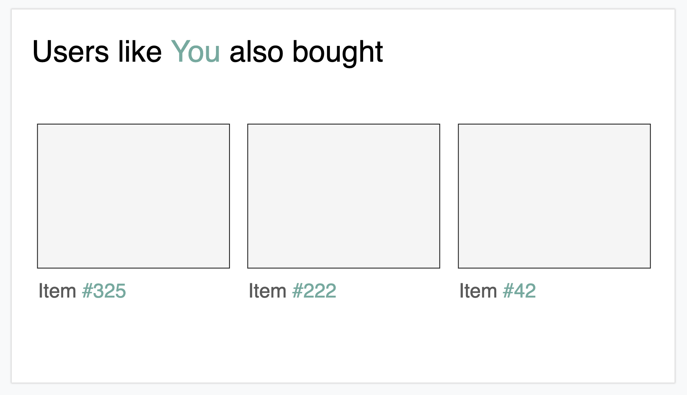
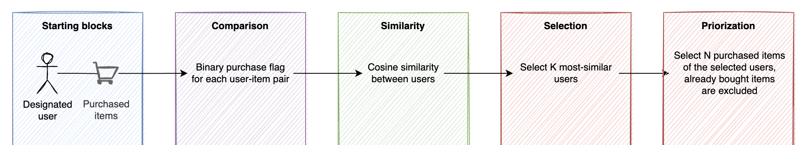

# Recommendation Systems Project

In this project, the goal is to implement a recommender system for a company in the field of e-commerce. For this scenario, the `Retailrocket E-commerce` [dataset from Kaggle](https://www.kaggle.com/datasets/retailrocket/ecommerce-dataset) is used.

The project objective is to experiment with various types of collaborative filtering, from simple and primitive ones, to exploring how matrix factorization could play a role in arriving at a better or more efficient model. Besides this objective, the implementation is driven by the business needs.

## Business Needs

### 1. Home page recommendations
When a user opens the home page of the e-commerce app, they should see relevant items as recommendations. The relevancy is based on the entire purchase history of the given user, for which similar users are selected and their most-relevant items are recommended for the user.

## Model Planning

### 1. Recommendation based on entire purchase history

## Model Implementations

### 1. User-based Collaborative Filtering

The model is called as `UserBasedCollabFilterRecommender` and it takes the the pivot and similarity matrices as inputs on initialization. Calling the `.fit(userid)` method, the model is fitted for the given user (visitor). In the fitting phase, records of the pivot and similarity matrices related to the given user is selected and those items that the user has already purchased are flagged. Calling the `.recommend(k, n)` method, the model makes the recommendation for the fitted user, where `k` denotes the maximum number of similar users to be considered, and `n` denotes the maximum items to be retrieved as recommendations. The model makes sure that the given user is not included in the similar user collection and that items the user already purchased are not recommended and do not waste the result space defined by `k` and `n`.

After finding the similar users, the items associated with these users' purchases are retrieved in an ordered fashion: the more-frequently the item is bought the better its position is in this list.

The model provides helper functions to access fitting data and recommendation data by `.get_fit_memory()` and `.get_recommend_memory()`.

## Recommendations

## Interpretation and Explanation

## Literature Review