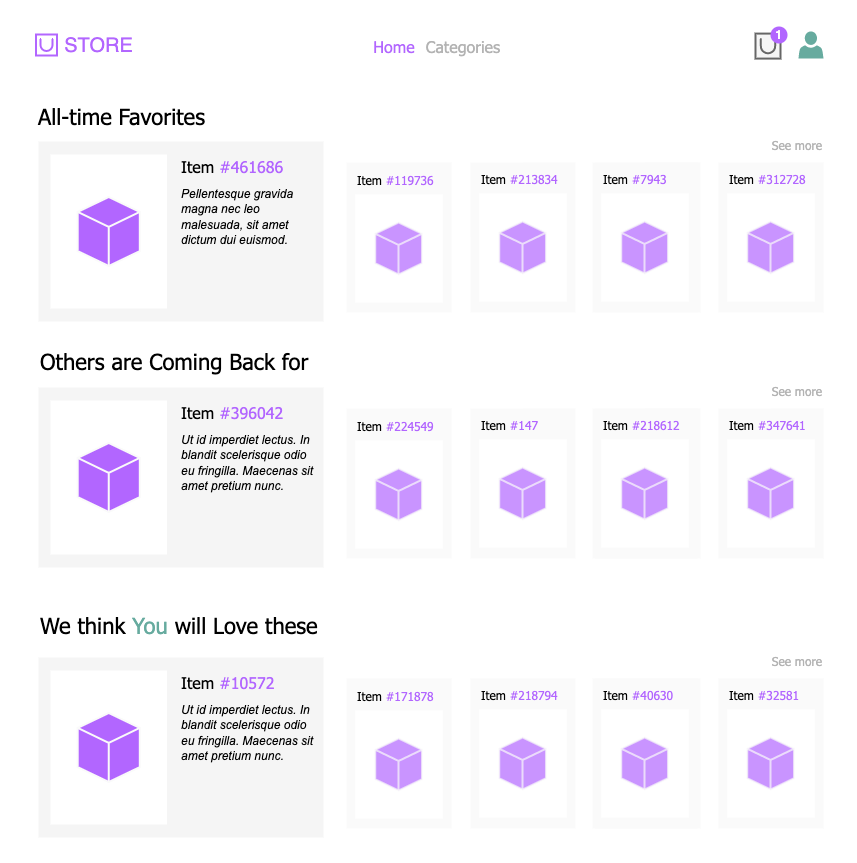

# Recommendation Systems Project

In this project, the goal is to implement a recommender system for a company in the field of e-commerce. For this scenario, the `Retailrocket E-commerce` [dataset from Kaggle](https://www.kaggle.com/datasets/retailrocket/ecommerce-dataset) is used.

The project objective is to experiment with various types of collaborative filtering, from simple and primitive ones, to exploring how matrix factorization could play a role in arriving at a better or more efficient model. Besides this objective, the implementation is driven by the business needs.

## Methodology

1.  Business needs

2.  Requirement details

3.  Model planning

4.  Model construction

5.  Evaluation

    1.  Recommendations

    2.  Verification

    3.  Interpretation

6.  Explanation

7.  Summary of different models

## Business Needs

**Home Page recommendations**\
When a user opens the home page of the online store, they should see relevant items as recommendations.

-   **Popular items**\
    The popularity can be measured from more angles, for example, total aggregated purchase count or average purchase count of an item.

-   **Items purchased by similar users**\
    The relevancy is based on the entire purchase history of the given user, for which similar users are selected and their most-relevant items are recommended for the user.

## Requirement Details

| Business need                    | In-app title                 | Expected behavior                                                                                                                                                         | Model name                             |
| -------------------------------- | ---------------------------- | ------------------------------------------------------------------------------------------------------------------------------------------------------------------------- | -------------------------------------- |
| Popular item recommendation      | All-time Favorites           | The N most-frequently purchased items are recommended.                                                                                                                    | `PopularItemRecommender`               |
| Popular item recommendation      | Others are Coming Back for   | The N items with the largest mean purchase frequency are recommended.                                                                                                     | `MeanPopularItemRecommender`           |
| Items purchased by similar users | We think You will Love these | Based on the entire purchase history of the given user, similar K users are selected and N items from their purchases (not yet bought by the given user) are recommended. | `UserBasedCollabFilterItemRecommender` |

## Model Planning

| Model name                             | User elements              | Measurement                                                | Similarity                            | Filtering            | Selection   |
| -------------------------------------- | -------------------------- | ---------------------------------------------------------- | ------------------------------------- | -------------------- | ----------- |
| `PopularItemRecommender`               | \-                         | Purchase frequency, item-wise                              | \-                                    | \-                   | Top N items |
| `MeanPopularItemRecommender`           | \-                         | Mean purchase frequency, item-wise, after grouping by user | \-                                    | \-                   | Top N items |
| `UserBasedCollabFilterItemRecommender` | Previously purchased items | Binary purchase flag, user-item pairwise                   | Cosine similarity, user-user pairwise | K-most similar users | Top N items |

## Model Implementations

### `PopularItemRecommender`

`PopularItemRecommender` takes the transactional dataset as input on initialization. Calling the `.recommend(n)` method, the model creates the recommendation where `n` denotes the maximum items to be retrieved as recommendations. It simply groups the dataset by `itemid` and counts the transactional events to select the top N items. As it appears, no fitting, no filtering takes place, therefore the recommendations will be the same for all users.

### `MeanPopularItemRecommender`

`MeanPopularItemRecommender` takes the transactional dataset as input on initialization. Calling the `.recommend(n)` method, the model creates the recommendation where `n` denotes the maximum items to be retrieved as recommendations. It simply groups the dataset by `userid` and `itemid` and counts the transactional events within these group then averages them to select the top N items. As it appears, no fitting, no filtering takes place, therefore the recommendations will be the same for all users.

### `UserBasedCollabFilterItemRecommender`

The model is called as `UserBasedCollabFilterItemRecommender` and it takes the the pivot and similarity matrices as inputs on initialization. Calling the `.fit(userid)` method, the model is fitted for the given user (visitor). In the fitting phase, records of the pivot and similarity matrices related to the given user is selected and those items that the user has already purchased are flagged. Calling the `.recommend(k, n)` method, the model makes the recommendation for the fitted user, where `k` denotes the maximum number of similar users to be considered, and `n` denotes the maximum items to be retrieved as recommendations. The model makes sure that the given user is not included in the similar user collection and that items the user already purchased are not recommended and do not waste the result space defined by `k` and `n`.

After finding the similar users, the items associated with these users' purchases are retrieved in an ordered fashion: the more-frequently the item is bought the better its position is in this list.

The model provides helper functions to access fitting data and recommendation data by `.get_fit_memory()` and `.get_recommend_memory()`.

## Recommendations

### `PopularItemRecommender`

|             |        |        |        |      |        |
| ----------- | -----: | -----: | -----: | ---: | -----: |
| **Item id** | 461686 | 119736 | 213834 | 7943 | 312728 |

### `MeanPopularItemRecommender`

|             |        |        |      |        |        |
| ----------- | -----: | -----: | ---: | -----: | -----: |
| **Item id** | 396042 | 224549 |  147 | 218612 | 347641 |

### `UserBasedCollabFilterItemRecommender`

|             |       |        |        |       |       |
| ----------- | ----: | -----: | -----: | ----: | ----: |
| **Item id** | 10572 | 171878 | 218794 | 40630 | 32581 |

## Verification

Verifications are issued after recommendations.

### Model 1.3. User-based Collaborative Filtering

`UserBasedCFRVerifier` ensures that the recommendations align with the requirements of `UserBasedCollabFilterRecommender`. Calling `run(designated_visitor_id)`, the following verifications are made:

-   user in recommndation matches the input
-   items flagged as already interacted with by the user are indeed in the original transactional dataset
-   the number of users similar to the given user is at most $K$ and the given user is not in the collection
-   the number of items recommended is at most $N$ and the items already interacted with by the user is not in the collection

## Interpretation and Explanation

### Model 1.1

### Model 1.2

## Summary

|                                  | Business need                 | Brief description                                                         | Levels | Advantages                                                                               | Limitations                                                                                                                                                                                            |
| -------------------------------- | ----------------------------- | ------------------------------------------------------------------------- | ------ | ---------------------------------------------------------------------------------------- | ------------------------------------------------------------------------------------------------------------------------------------------------------------------------------------------------------ |
| PopularItemsRecommender          | 1\. Home page recommendations | Recommends the most-frequently purchased items.                           | Global | It is easy to implement and to recommend items. It is applicable in the cold-start case. | It may be biased by differences in purchase scales across items or users. It does not make any filtering related to the actual user: same results for everyone.                                        |
| PopularItemsOnAverageRecommender |                               | Recommends the most-frequently purchased items yet based on a mean value. | Global | It is easy to implement and to recommend items. It is applicable in the cold-start case. | It may be biased by differences in purchase scales across items but the differences across users is now reduced. It does not make any filtering related to the actual user: same results for everyone. |

## Literature Review